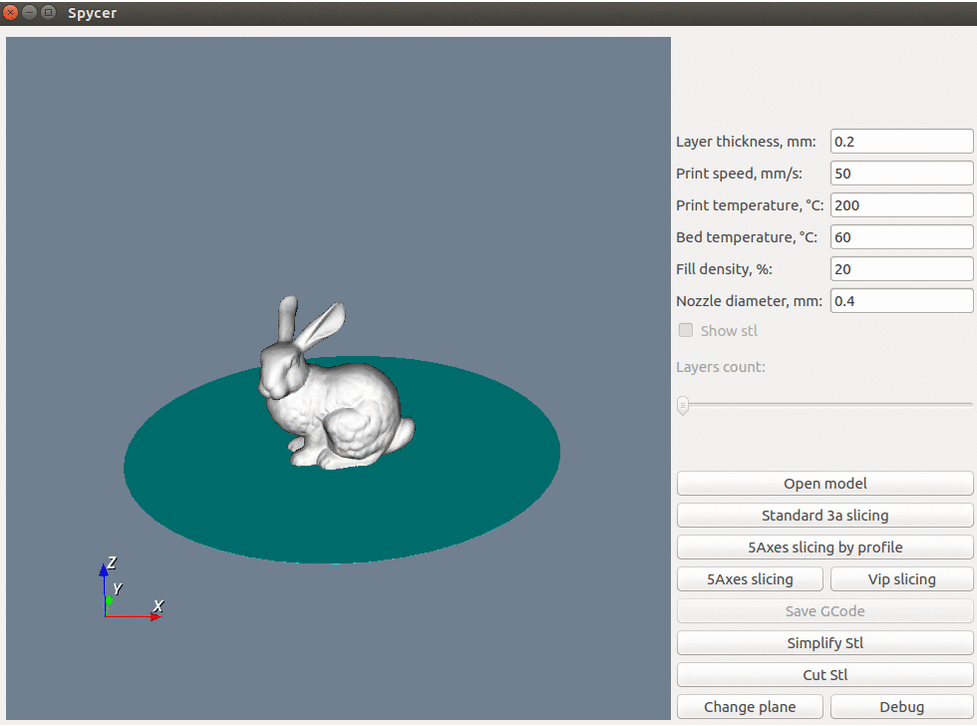

# spycer
Tool to display stl, gcode. Main feature - support rotations of bed for <b>5axes 3d printer</b>.

Initially works with [goosli](https://github.com/l1va/goosli) backend (slicer for 5axes 3d printer), 
but can be easily adapted for any slicer. 

Support gcode generated by <b>Cura</b> slicer.

### Dependencies
 - python3
 - pyQt5
 - pyVTK

### Install
##### Linux (tested on Ubuntu 16.04)
0) Install dependencies 
```bash
sudo apt-get install python3-pyqt5
sudo apt-get install python-pyvtk
```
1) Build [goosli](https://github.com/l1va/goosli) binaries
2) Put them with 'data' directory to spycer and update pathes in params.py
3) Just run `python3 main.py`

##### Windows (tested on Windows 10)
~~Installation details (https://l1va.ru/en/pyqt_and_pyvtk_on_windows/)~~

Alternate way found: `pip install pyqt5 vtk pyvtk`
Tested on Windows 10, Visual studio 2019, python 3.7 x64

### Parameters
see params.py

### Build exe
python setup.py build

### Result


Feel free to open issues and create pull requests.
