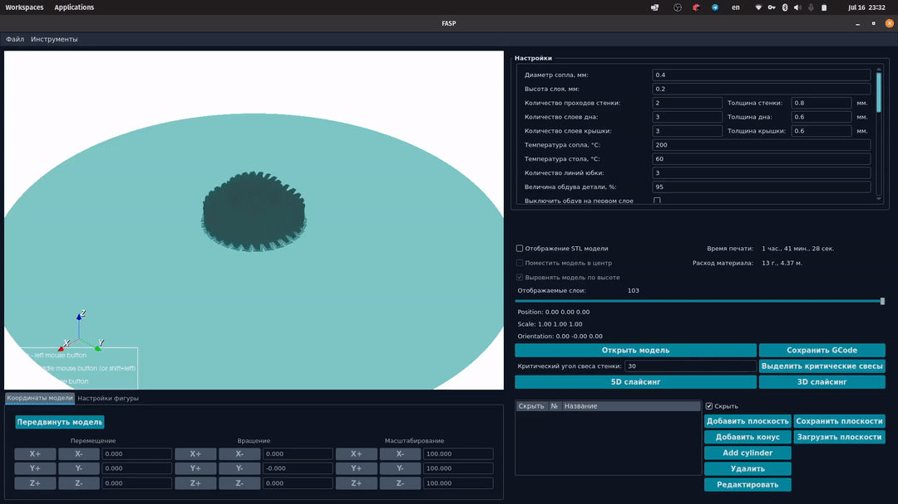
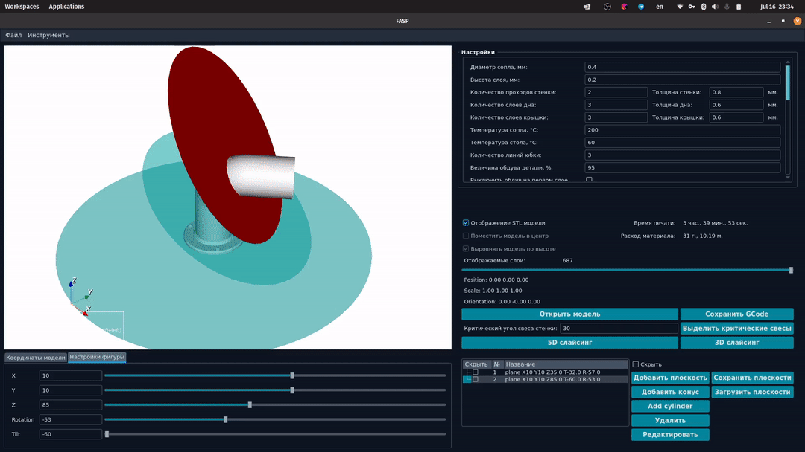
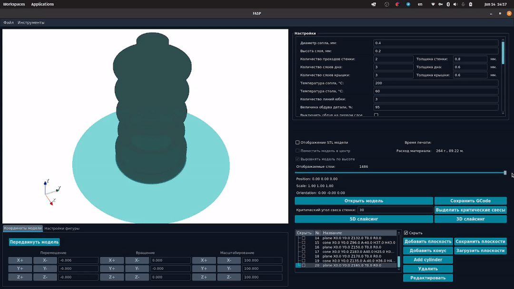
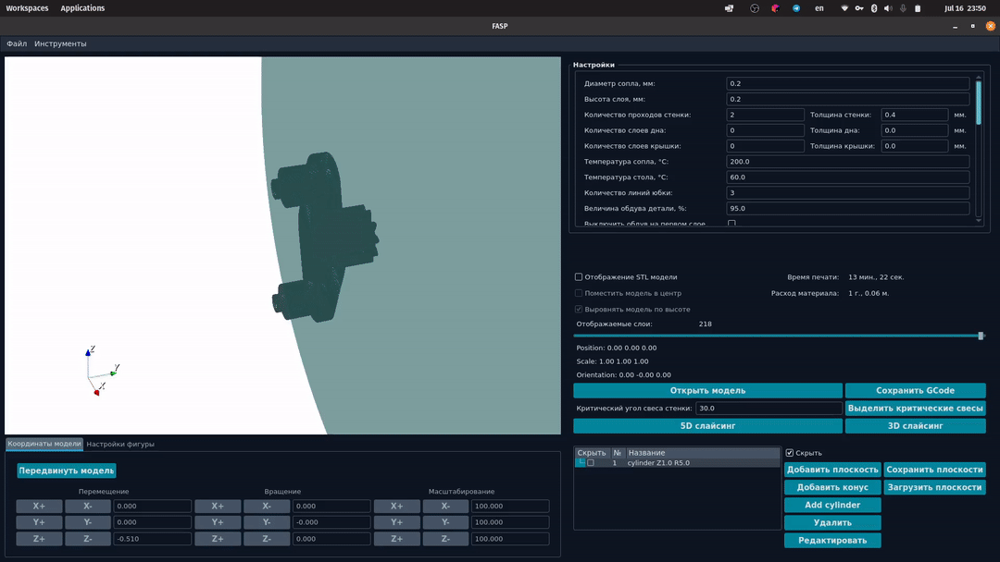

# Spycer - GUI for 5 axes 3D printer

## Table of Contents

- [About](#about)
- [Ask for demo](#ask-for-demo)
- [Basic usage](#basic-usage)
- [Installation](#installation)
- [Contributing](#contributing)

## About

Spycer is a GUI tool for innovative 5 axes 3D printer. See our [website](https://epit3d.com/).

## Ask for demo

If you want to try our Five Axes Slicing Program and interested in 5 axes 3D printer - feel free to contact us: [Info@epit3d.ru](mailto:Info@epit3d.ru?subject=FASP%20demo%20request&body=Hello%2C%20I%20want%20to%20try%20Spycer%20and%20FASP%20slicer)

### Features of FASP slicer (Five Axes Slicing Program):

- [x] Interactive calibration

    
[x] 3D slicing

    

    
[x] Multi-plane slicing

    

    
[x] Cone slicing

    

    
[x] Cylinder slicing

    

- [] Smooth slicing
- [x] Lids processing
- [x] Supports processing
- [x] Gcode preview (with rotations of bed)

## Basic usage

Right now you can use Spycer in "preview" mode.
It means that you can locally setup Spycer and see our possibilities without having slicer and 5 axes 3D printer.
Slicer software we develop is not open source yet, but you can ask us for demo.

For legacy use you can try latest open source version of slicer: [goosli](https://github.com/epit3d/goosli).
We do not have capabilities to support integration with current Spycer version, but you may try old Spycer version from about Oct 24, 2020.

## Installation

Preview mode does not require the optional git submodules under `src/server_api` and `src/hardware`.

### Run with Docker

This is the most reliable way to run Spycer locally on macOS or Linux because the host does not need Python 3.10, PyQt5, or VTK installed.

1. Make sure Docker Desktop is running.
1. Build and start the app: `docker compose up --build`
1. Open [http://localhost:6080/vnc.html](http://localhost:6080/vnc.html) in your browser.
1. Stop the app with `Ctrl+C` in the terminal, then run `docker compose down`.

Notes:

- On Apple Silicon, the compose file defaults to `linux/amd64` for better wheel compatibility with `vtk` and `PyQt5`. If you want to try native ARM images, run `DOCKER_PLATFORM=linux/arm64 docker compose up --build`.
- Port `6080` serves the browser-based desktop via noVNC.
- Port `5900` exposes raw VNC if you prefer a VNC client.

### Run natively

1. Install [Python 3.10](https://www.python.org/downloads/release/python-3100/).
1. Create a virtual environment: `python3.10 -m venv venv`
1. Activate it:
   - Windows: `venv\Scripts\activate.bat`
   - Linux/macOS: `source venv/bin/activate`
1. Install dependencies:
   - Linux: `pip install -r linux-req.txt`
   - Windows: `pip install -r win-req.txt`
1. Run Spycer: `python main.py`

If you only have Python 3.9 installed, the app will not start because the codebase uses Python 3.10 syntax.

## Contributing

Feel free to open issues and create pull requests. We will be happy to see your contributions and ideas.
